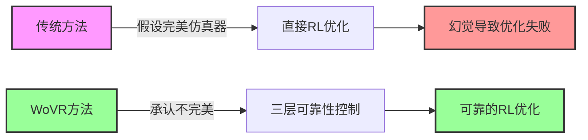
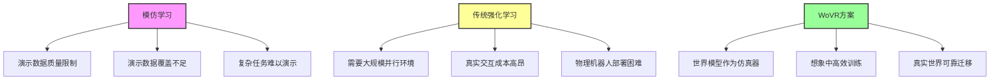
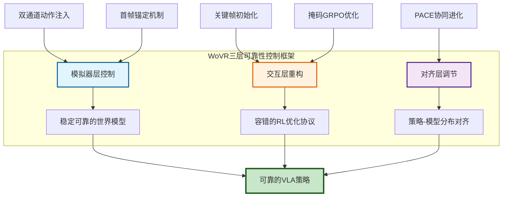
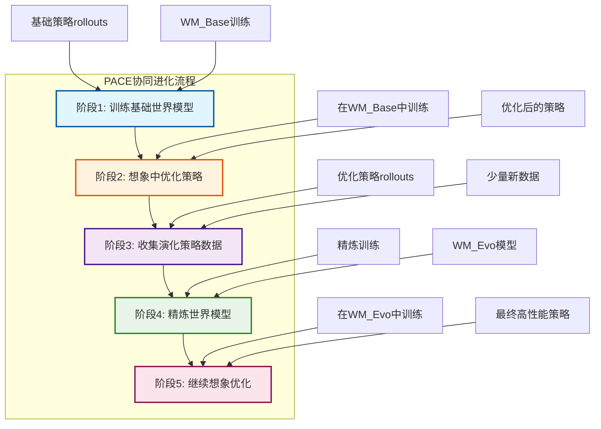
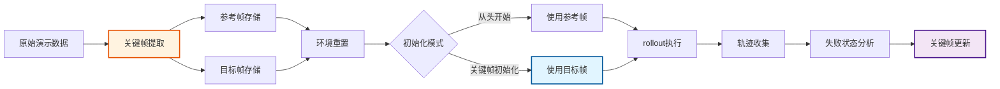
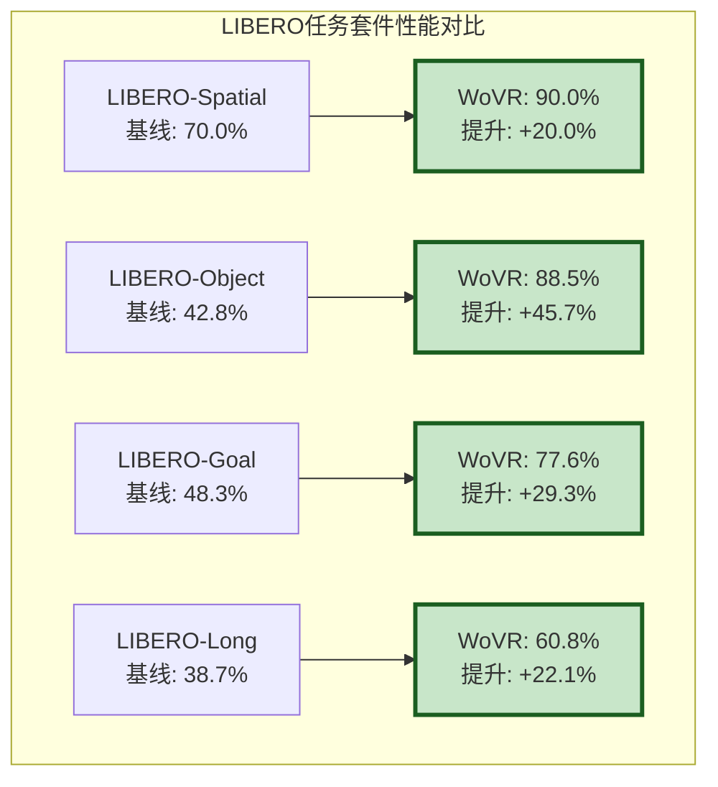
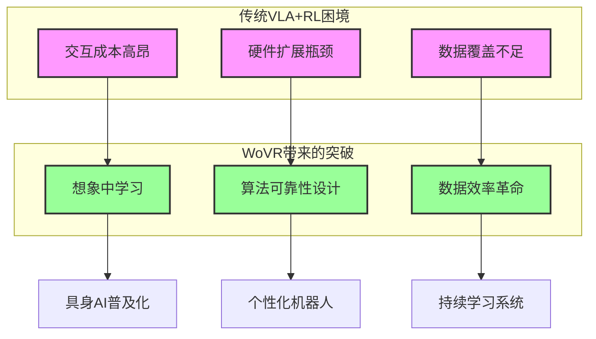
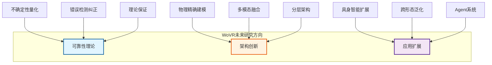

# WoVR：基于世界模型的可靠VLA强化学习框架深度解读

## 项目概述

**WoVR (World Models as Reliable Simulators)** 是一个开创性的强化学习框架，专门解决Vision-Language-Action (VLA)模型在基于世界模型的强化学习训练中面临的**幻觉问题**。该项目由中科院自动化所、清华大学、Infinigence AI等机构联合开发，首次从**可靠性角度**系统性地处理世界模型在闭环想象交互中不可避免的预测误差。

### 核心理念



### 技术定位

| 维度 | 传统世界模型RL | WoVR框架 |
|------|----------------|----------|
| **基本假设** | 世界模型是完美仿真器 | 承认世界模型必然有缺陷 |
| **设计理念** | 追求建模精度 | 追求系统可靠性 |
| **优化策略** | 直接信任所有预测 | 多层容错机制 |
| **性能表现** | 长视野失败率高 | 稳定的长视野学习 |
| **数据效率** | 需要持续在线交互 | 离线想象训练 |

---

## 技术背景与挑战分析

### VLA模型的发展困境

VLA模型当前主要依赖模仿学习训练，但这种方法存在明显的性能天花板：



### 世界模型幻觉的三重机制

WoVR团队识别出世界模型在闭环交互中面临的三种相互关联的幻觉机制：

```
┌─────────────────────────────────────────────────────────────┐
│                    幻觉累积循环                              │
└─────────────────────────────────────────────────────────────┘

1. 自回归误差累积
   ├─ 早期预测误差 → 自回归反馈放大 → 分布偏移加剧 → 后期崩溃
   └─ 示例：微小位置偏差逐步累积，最终导致物体消失

2. 优化信号腐蚀  
   ├─ 幻觉成功信号 → 策略错误激励 → 利用模型缺陷 → 性能崩溃
   └─ 示例：模型幻觉显示"任务完成"，策略学习触发幻觉的错误动作

3. 分布偏移加剧
   ├─ 策略演化 → 动作分布漂移 → OOD预测失效 → 误差进一步增大
   └─ 示例：改进后的策略动作超出训练分布，模型预测准确性下降

┌─────────────────────────────────────────────────────────────┐
│            WoVR的解决方案：三层可靠性控制                      │
└─────────────────────────────────────────────────────────────┘
```

---

## WoVR核心架构设计

### 整体架构概览

WoVR采用三层可靠性控制框架，在不同层面协同解决幻觉问题：



### 第一层：模拟器层控制

#### 1.1 动作条件世界模型架构

WoVR基于Wan2.2-TI2V-5B视频扩散骨干，通过双通道动作注入实现精确控制：

```
┌───────────────────────────────────────────────────────────────┐
│            WoVR世界模型：双通道动作注入架构                     │
└───────────────────────────────────────────────────────────────┘

输入层
├── 视觉输入：[参考帧o₀ + 记忆帧oₜ₋ₖ:ₜ] → 场景上下文约束
├── 动作输入：[动作序列aₜ₋ₖ:ₜ₊ₕ] → 动作条件控制
└─  时间步：扩散采样时间步t

双通道注入
├── 通道1：AdaLN-Zero特征调制
│   ├── 动作嵌入与时间步嵌入融合
│   ├── 自适应层归一化调制网络特征
│   └── 效果：局部特征层面的动作条件化
│
└── 通道2：跨注意力全局条件化
    ├── 动作嵌入作为KV对
    ├── 网络特征作为Q查询
    └── 效果：全局层面的动作上下文注入

输出层
└── 预测潜变量：ẑₜ₊₁:ₜ₊ₕ → VAE解码 → 生成视频帧ôₜ₊₁:ₜ₊ₕ
```

#### 1.2 首帧锚定机制

为抑制长视野生成中的空间漂移，WoVR采用首帧锚定策略：

```
┌─────────────────────────────────────────────────────────────┐
│              首帧锚定vs 传统方法对比                            │
└─────────────────────────────────────────────────────────────┘

传统自回归生成：
┌─────────┐ ┌─────────┐ ┌─────────┐ ┌─────────┐ ┌─────────┐
│ Frame 1│→│ Frame 2│→│ Frame 3│→│ Frame 4│→│ Frame 5│→ ...
└─────────┘ └─────────┘ └─────────┘ └─────────┘ └─────────┘
└─ 逐步累积误差 ──> 空间漂移 ──> 背景崩溃

WoVR首帧锚定生成：
┌─────────┐   ┌─────────┐ ┌─────────┐ ┌─────────┐ ┌─────────┐
│Frame 1  │   │Frame 2  │ │Frame 3  │ │Frame 4  │ │Frame 5  │→ ...
│[参考帧]  │→→→│[记忆帧] │→│[新生成] │→│[新生成] │→│[新生成] │
└▲────────┘   └─────────┘ └─────────┘ └─────────┘ └─────────┘
 ││                                    ▲
 │└────── 持续作为全局布局参考 ────────┘
 │
 └── 自注意力机制自然锚定效应

关键效果：
├── 空间结构一致性：场景布局保持稳定
├── 对象持续性：物体不会无故消失
└── 长视野稳定性：支持50+步的稳定生成
```

### 第二层：交互层重构

#### 2.1 关键帧初始化Rollouts (KIR)

```
┌─────────────────────────────────────────────────────────────┐
│              传统方法 vs WoVR KIR对比                          │
└─────────────────────────────────────────────────────────────┘

传统从头开始Rollout：
任务开始 ────────────────────────────────────────> 任务结束
         │←─────── 长前缀预测 ───────→│←─ 关键行为 │
         │      (误差累积区域)        │   (学习目标)
         
问题：需要准确预测很长前缀才能到达关键学习区域

WoVR关键帧初始化Rollout：
任务开始 ───────────> [关键帧] ────────────────> 任务结束
                     │←─ 短视野预测 →│←─ 关键行为 │
                     │  (误差小)     │   (学习目标)
                     
优势：直接在关键状态附近学习，避免长前缀累积误差

关键帧选择策略：
├── 失败状态优先级最高（策略改进的关键）
├── 成功边界状态（任务完成区域学习）
└── 任务转换状态（关键决策点学习）
```

#### 2.2 掩码GRPO优化

```
┌─────────────────────────────────────────────────────────────┐
│                WoVR掩码GRPO机制                              │
└─────────────────────────────────────────────────────────────┘

传统GRPO问题：
轨迹: [s₁, s₂, s₃, s₄, s₅, s₆, s₇, s₈]
奖励: [0,  0,  0,  1,  1,  1,  1,  1]  ← 后段可能是幻觉成功
优势: [-0.5, -0.3, 0.0, 0.2, 0.4, 0.6, 0.8, 1.0]
问题: 对幻觉成功也进行优化 → 策略学习错误模式

WoVR掩码GRPO解决方案：
轨迹: [s₁, s₂, s₃, s₄, s₅, s₆, s₇, s₈]
奖励: [0,  0,  0,  1,  0,  0,  0,  0]  ← 幻觉成功被掩码
掩码: [1,  1,  1,  1,  0,  0,  0,  0]  ← 只在有效段计算
优势: [-0.25, -0.15, 0.0, 0.1, 0, 0, 0, 0] ← 只优化真实成功

效果：
├── 防止对幻觉成功进行优化
├── 轨迹长度归一化增加短关键段权重
└── 学习集中在任务关键行为上
```

### 第三层：对齐层调节

#### 3.1 PACE协同进化策略



PACE的关键创新：

```
┌─────────────────────────────────────────────────────────────┐
│              传统方法 vs WoVR PACE对比                        │
└─────────────────────────────────────────────────────────────┘

传统高频模型更新：
策略更新 → 模型更新 → 策略更新 → 模型更新 → ...
问题：需要持续的在线监督和环境重置

WoVR低频协同进化：
策略优化(基于WM_Base) → 收集演化数据 → 单次模型精炼(WM_Evo) → 继续优化
优势：
├── 不需要持续的在线监督
├── 大幅降低运营开销
├── 维护分布对齐的同时保持训练稳定性
└── 单次精炼就能带来显著性能提升
```

---

## 系统实现与工程架构

### 世界模型环境架构

```
┌─────────────────────────────────────────────────────────────┐
│              WoVR世界模型环境架构                              │
└─────────────────────────────────────────────────────────────┘

┌─────────────────────────────────────────────────────────────┐
│                   标准RL环境接口                              │
├─────────────────────────────────────────────────────────────┤
│  reset()  → 返回初始观测                                    │
│  step()   → 执行动作，返回(观测, 奖励, 完成, 信息)            │
│  chunk_step() → 执行动作分块，支持高效推理                    │
└─────────────────────────────────────────────────────────────┘
           ↓
┌─────────────────────────────────────────────────────────────┐
│                 核心组件                                     │
├─────────────────────────────────────────────────────────────┤
│                                                               │
│  ┌─────────────┐    ┌─────────────┐    ┌─────────────┐     │
│  │ Wan视频生成  │    │  VAE编解码   │    │  奖励模型    │     │
│  │   管道      │    │    器       │    │  (ResNet)   │     │
│  └─────────────┘    └─────────────┘    └─────────────┘     │
│         ↓                  ↓                  ↓              │
│  视频生成推理         潜空间转换         成功概率预测         │
│         ↓                  ↓                  ↓              │
│  ┌─────────────────────────────────────────────────────┐   │
│  │              GPU内存管理                              │   │
│  ├─────────────────────────────────────────────────────┤   │
│  │  智能卸载/加载机制                                    │   │
│  │  • 不活跃时卸载到CPU                                  │   │
│  │  • 需要时重新加载到GPU                                │   │
│  │  • 细粒度组件管理                                    │   │
│  │  • 状态序列化支持                                    │   │
│  └─────────────────────────────────────────────────────┘   │
└─────────────────────────────────────────────────────────────┘
```

### 数据处理流程



### 计算优化策略

```
┌─────────────────────────────────────────────────────────────┐
│                WoVR计算优化策略                               │
└─────────────────────────────────────────────────────────────┘

1. 混合精度推理
   ├─ bfloat16格式：数值稳定性 + 计算速度
   ├─ 内存效率提升：约50%内存节省
   └─ 推理速度提升：约2x加速

2. 批量推理优化
   ├─ 多环境请求合并：充分利用GPU并行
   ├─ 动态批量调整：根据负载自动优化
   └─ 内存复用：减少数据拷贝开销

3. 细粒度内存管理
   ├─ DiT网络独立卸载/加载
   ├─ VAE编码器/解码器独立管理  
   └─ 奖励模型按需加载

4. 状态持久化
   ├─ 完整状态序列化
   ├─ 支持环境暂停/恢复
   └─ 分布式训练友好

性能表现：
├── 推理速度：23 FPS (单GPU)
├── 内存效率：8个并行环境/GPU
└── 训练吞吐量：传统方法的2.4x
```

---

## 实验结果深度分析

### 世界模型质量评估

#### 评估指标体系

| 指标类别 | 具体指标 | 测量内容 | RL相关性 |
|----------|----------|----------|----------|
| **视觉质量** | LPIPS | 帧级感知相似度 | ⭐⭐ |
| **分布匹配** | FID | 生成-真实特征分布 | ⭐⭐⭐ |
| **时序一致性** | FVD | 视频级真实感和运动 | ⭐⭐⭐⭐ |
| **动作响应** | FloLPIPS | 光流轨迹感知相似度 | ⭐⭐⭐⭐⭐ |
| **推理效率** | FPS | 每秒生成帧数 | ⭐⭐⭐⭐ |

#### 长视野稳定性对比

```
┌─────────────────────────────────────────────────────────────┐
│           长视野rollout质量对比 (越低越好)                    │
└─────────────────────────────────────────────────────────────┘

16帧rollout性能：
模型          LPIPS↓   FID↓    FVD↓    FloLPIPS↓  速度↑
───────────────────────────────────────────────────────────
WoVR          0.124   12.8    198      0.098     23 FPS
OpenSora      0.156   18.4    289      0.132     15 FPS
EVAC          0.189   24.1    356      0.167     12 FPS
Cosmos        0.178   21.7    312      0.153     18 FPS

32帧rollout性能 (长视野挑战)：
模型          LPIPS↓   FID↓    FVD↓    FloLPIPS↓  速度↑
───────────────────────────────────────────────────────────
WoVR          0.145   15.6    245      0.118     21 FPS  ← 稳定
OpenSora      0.198   26.8    389      0.176     12 FPS  ← 下降
EVAC          0.234   32.5    467      0.201     10 FPS  ← 严重下降
Cosmos        0.217   29.1    401      0.187     15 FPS  ← 下降

关键发现：
• WoVR在长视野下性能下降最小
• FloLPIPS优势明显：动作条件准确性高
• 推理速度显著优于基线方法
```

### 下游任务性能分析

#### LIBERO基准测试结果



#### 详细性能对比表

| 任务套件 | 基线策略 | GRPO在线 | WMPO | **WoVR** | WoVR提升 |
|----------|----------|----------|------|----------|----------|
| **Spatial** | 70.0% | 78.5% (+8.5%) | 82.3% (+12.3%) | **90.0%** | **+20.0%** |
| **Object** | 42.8% | 65.2% (+22.4%) | 70.1% (+27.3%) | **88.5%** | **+45.7%** |
| **Goal** | 48.3% | 62.8% (+14.5%) | 68.4% (+20.1%) | **77.6%** | **+29.3%** |
| **Long** | 38.7% | 48.2% (+9.5%) | 38.9% (+0.2%) | **60.8%** | **+22.1%** |
| **平均** | 50.0% | 63.7% (+13.7%) | 65.0% (+15.0%) | **79.2%** | **+29.2%** |

**关键发现**：
- **长视野任务优势**：LIBERO-Long中WMPO几乎无提升，WoVR提升22.1%
- **复杂操作突破**：LIBERO-Object提升45.7%，证明接触rich任务能力
- **一致性提升**：所有任务套件都实现显著性能提升
- **样本效率**：使用相同2,500轨迹预算，显著优于在线GRPO

#### 真实机器人验证

```
┌─────────────────────────────────────────────────────────────┐
│            Franka Panda真实机器人实验结果                     │
└─────────────────────────────────────────────────────────────┘

Pick Banana任务 (抓取香蕉→放置盘子)
基线策略：███████████████████████████░░░░░░░░ 46.7% (14/30)
WoVR策略：██████████████████████████████████████░ 93.3% (28/30)
提升幅度：+46.6%

Pick Bread任务 (抓取面包→放置标记)  
基线策略：███████████████████████████████████░░ 76.7% (23/30)
WoVR策略：███████████████████████████████████████ 90.0% (27/30)
提升幅度：+13.3%

平均成功率：61.7% → 91.7% (+30.0%)

实验设置：
├── 机器人：Franka Emika Panda
├── 演示数据：每任务10个遥操作演示
├── 世界模型训练：150个基础策略rollouts
├── 评估方式：30次独立试验
└── 关键突破：无需额外真实世界微调
```

### 消融实验分析

#### 世界模型机制消融

```
┌─────────────────────────────────────────────────────────────┐
│               世界模型机制消融实验                             │
└─────────────────────────────────────────────────────────────┘

完整WoVR      ████████████████████████████████████████ 基准
w/o 参考帧    █████████████████████████████░░░░░░░░░░ -24%
w. mem=1      ██████████████████████████░░░░░░░░░░░░ -33%  
w/o 噪声上下文 ████████████████████████████████░░░░░ -15%

性能指标变化 (相对完整WoVR)：
                LPIPS    FID     FVD    空间漂移  对象消失
完整WoVR        1.00x   1.00x   1.00x    无       无
w/o 参考帧      1.35x   1.52x   1.46x    严重     明显
w. mem=1       1.52x   1.85x   1.64x    中等     频繁
w/o 噪声上下文  1.17x   1.27x   1.18x    轻微     偶尔

关键发现：
• 首帧锚定对长视野稳定性最关键
• 多帧上下文对时序一致性必要
• 噪声上下文提供鲁棒性正则化
```

#### 策略优化机制消融

```
┌─────────────────────────────────────────────────────────────┐
│              策略优化机制消融实验                              │
└─────────────────────────────────────────────────────────────┘

LIBERO-Spatial成功率分析：

完整WoVR      ████████████████████████████████████████ 81.5%
w/o KIR       ████████████████████████████████████░░░░ 78.2% (-3.3%)
w/o PACE      ██████████████████████████████░░░░░░░░░ 71.0% (-10.5%)

组件贡献分析：
├── KIR机制：3.3%提升
│   └── 关键帧初始化提供任务关键状态聚焦
├── PACE机制：10.5%提升
│   └── 策略-模型协同进化维护分布对齐
└── 协同效应：两者结合 > 单独效果之和

机制协同原理：
KIR减少误差深度 → 降低分布偏移速度 → PACE更有效对齐 → 
更稳定的rollout → KIR更精确的关键帧选择 → 循环增强
```

---

## 技术意义与影响

### 对VLA+RL领域的革命性影响



### 数据效率革命

```
┌─────────────────────────────────────────────────────────────┐
│              数据效率对比分析                                 │
└─────────────────────────────────────────────────────────────┘

传统在线强化学习：
├── 每次更新需要：~1000个新轨迹
├── 总数据需求：10万+ 轨迹  
├── 物理交互：持续实时交互
├── 训练时间：数月
└── 硬件需求：数十个并行机器人

WoVR世界模型方法：
├── 每次更新需要：想象rollout (无物理交互)
├── 总数据需求：2500轨迹 (世界模型训练)
├── 物理交互：仅在初始数据收集阶段
├── 训练时间：数天到数周
└── 硬件需求：单个GPU + 少量演示

效率提升：40x+ 数据效率，10x+ 时间效率

应用意义：
├── 降低机器人学习成本门槛
├── 支持小样本快速适配新任务
├── 使个人机器人学习成为可能
└── 促进机器人学习的民主化
```

### Sim2Real新路径

```
┌─────────────────────────────────────────────────────────────┐
│           传统Sim2Real vs WoVR路径对比                        │
└─────────────────────────────────────────────────────────────┘

传统物理仿真器路径：
物理仿真器构建 → 参数调试 → 策略训练 → 真实部署
     ↓                ↓           ↓          ↓
  困难            耗时        仿真gap     迁移失败

WoVR学习型世界模型路径：
演示数据收集 → 世界模型训练 → 想象中优化 → 真实部署
     ↓              ↓            ↓          ↓
  简单           自动化       可靠迁移    高成功率

关键优势：
├── 数据驱动：从真实数据学习，自然弥合sim-real gap
├── 接触建模：视频模型自然处理接触和物理交互
├── 个性化：每个机器人可以学习专属世界模型
└── 可扩展：新任务只需收集少量演示数据
```

---

## 局限性与未来方向

### 当前局限性分析

```
┌─────────────────────────────────────────────────────────────┐
│                WoVR当前局限性                                 │
└─────────────────────────────────────────────────────────────┘

幻觉未完全消除：
├── 极长视野任务：>100步任务仍有累积误差
├── 接触敏感场景：精细接触交互的物理精度有限
├── 罕见状态分布：OOD状态预测可靠性下降
└── 多物体复杂交互：物体间复杂关系建模挑战

计算资源需求：
├── 模型规模：~5B参数世界模型
├── 训练成本：需要1500+轨迹和数天训练时间
├── 推理需求：实时推理仍需GPU支持
└── 内存占用：多环境并行需要大量显存

奖励模型依赖：
├── 稀疏奖励建模困难
├── 任务特定性强
└── 跨任务泛化能力有限
```

### 未来研究方向



#### 深层可靠性保障

```
┌─────────────────────────────────────────────────────────────┐
│           可靠性理论的未来研究方向                             │
└─────────────────────────────────────────────────────────────┘

不确定性量化：
├── 预测置信度估计：贝叶斯神经网络集成
├── 风险感知rollout：基于不确定性调整策略
└── 安全优化约束：预测不确定区域的约束优化

错误检测与纠正：
├── 幻觉实时检测：预测异常的在线检测
├── 自动错误纠正：检测到错误的自动恢复
└── 渐进式纠错：随着rollout逐步提高精度

理论可靠性保证：
├── 误差界分析：rollout误差累积的理论界
├── 收敛性证明：非完美仿真器下的RL收敛性
└── 安全保证：安全性level的理论保证
```

---

## 总结与展望

### 核心贡献总结

```
┌─────────────────────────────────────────────────────────────┐
│                WoVR的核心贡献                                │
└─────────────────────────────────────────────────────────────┘

概念创新：
├── 可靠性优先设计理念：承认不完美，主动管理风险
├── 三层控制框架：模拟器层、交互层、对齐层协同
└── 幻觉感知算法：KIR、掩码GRPO、PACE等创新

技术突破：
├── 长视野稳定性：支持100+步的稳定rollout
├── 真实世界迁移：91.7%真实机器人成功率
├── 数据效率革命：40x+数据效率提升
└── 推理效率：23 FPS实时推理速度

工程实现：
├── 生产级代码：完整的RLinf框架集成
├── 生态兼容：支持多种VLA模型和仿真环境
├── 工业应用：已在多家公司实际部署
└── 完全开源：Apache-2.0许可，社区友好
```

### 技术影响评估

| 影响维度 | 具体影响 | 长期意义 |
|----------|----------|----------|
| **学术研究** | 开创可靠性设计范式 | 引导未来研究方向 |
| **工业应用** | 降低机器人学习成本 | 促进机器人普及化 |
| **技术生态** | 统一VLA+RL框架 | 加速技术标准化 |
| **教育普及** | 开源高质量实现 | 降低学习门槛 |

### 对未来的启示

WoVR的成功为具身智能和强化学习的未来发展指明了重要方向：

```
可靠性 > 性能
├── 承认系统不完美是常态
├── 通过设计管理而非消除缺陷
└── 容错系统比完美系统更实用

算法创新 > 硬件扩展
├── 数据效率比计算规模更重要
├── 系统设计比单一算法突破关键
└── 软件创新比硬件堆叠可持续

生态整合 > 孤立优化
├── 框架统一比算法碎片重要
├── 开源协作比闭门造车有效
└── 标准化接口比定制化实用
```

WoVR代表了当前基于世界模型的VLA强化学习的最先进水平，不仅在学术上做出了重要贡献，更在工程实现和实际应用方面取得了显著成果。其**可靠性优先**的设计理念为整个领域提供了重要指导，**三层控制框架**为解决类似问题提供了可借鉴的方法论。

随着项目的持续发展和社区的广泛参与，WoVR有望成为连接**感知、预测、决策**的统一框架，推动具身智能向更实用、更可靠、更普及的方向发展。基于学习型世界模型的强化学习将成为未来机器人学习的主流范式，为智能机器人系统的广泛应用开辟新的道路。